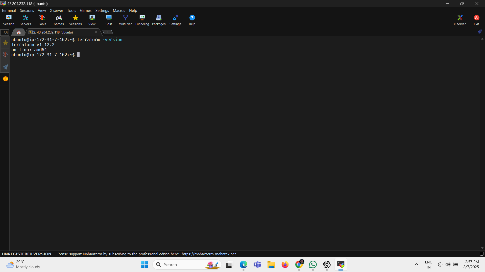
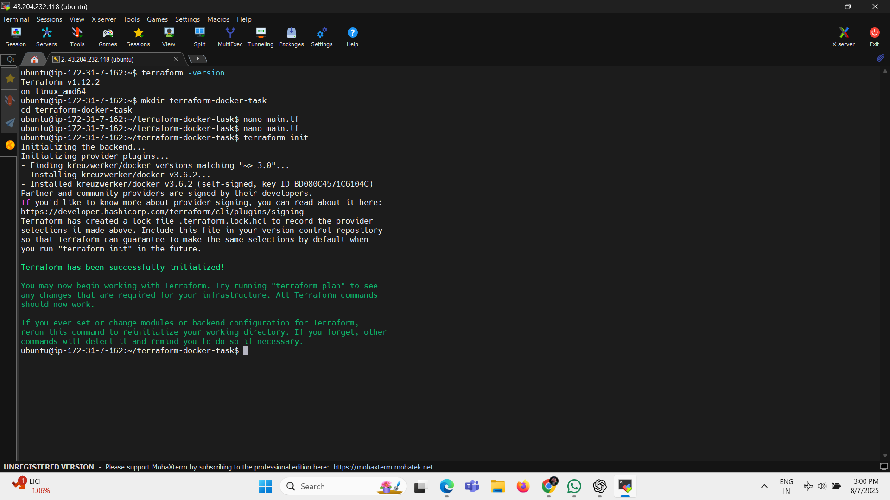
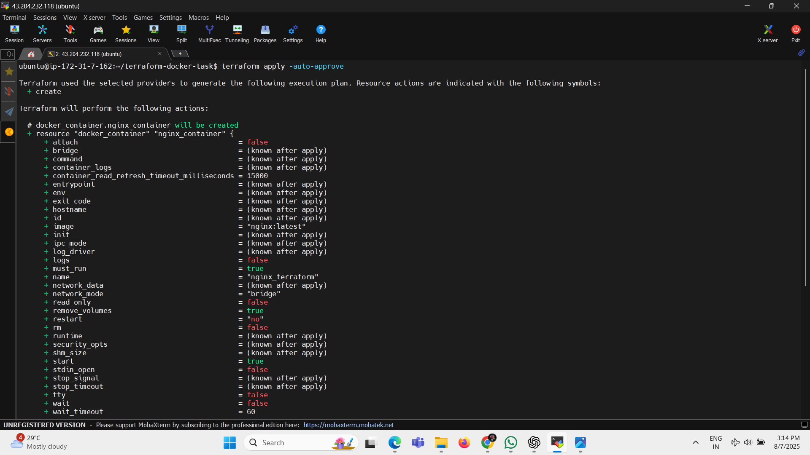
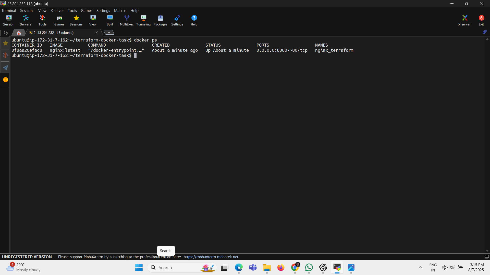
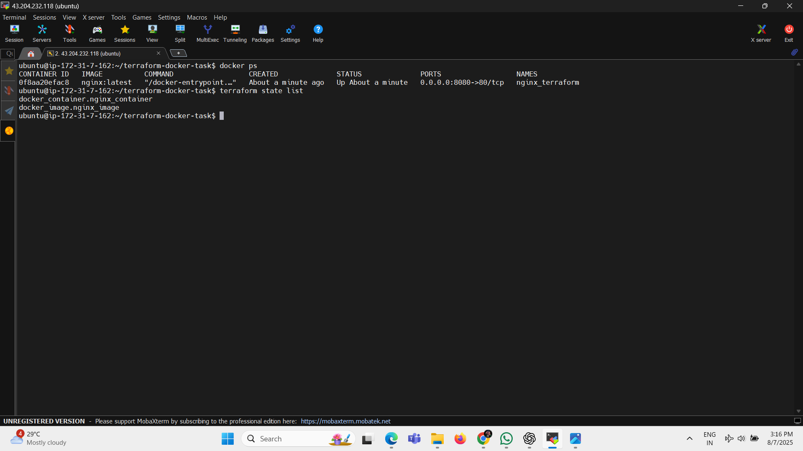
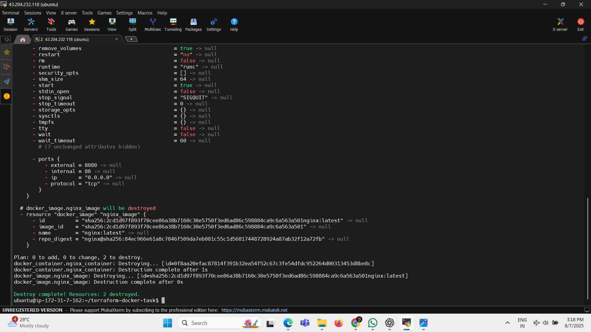

# Terraform Docker Container Provisioning

## 📌 Objective
Provision a Docker container (nginx) using Terraform on a local environment (EC2 Ubuntu).

## 🧰 Tools Used
- Terraform v1.8.3
- Docker vXX
- Ubuntu EC2

## 📝 Steps Followed
1. Installed Terraform and Docker
2. Wrote `main.tf` using Docker provider
3. Initialized Terraform using `terraform init`
4. Planned the infrastructure using `terraform plan`
5. Applied the configuration using `terraform apply`
6. Verified the container with `docker ps`
7. Listed the Terraform state
8. Destroyed the infrastructure using `terraform destroy`

## 📷 Screenshots

### 1. Terraform Version

### 2. Docker Version

### 3. main.tf File

### 4. Terraform Init

### 5. Terraform Plan

### 6. Terraform Apply

### 7. Docker PS

### 8. Terraform State List

### 9. Terraform Destroy

## ✅ Outcome
Understood how to use Terraform as Infrastructure as Code (IaC) to provision and manage Docker containers effectively on a local Ubuntu-based EC2 instance.

## 💻 Author
**Ravikant Jadhav**  
[GitHub Profile](https://github.com/Ravikant199899)
